# About this Site Web

This site was created as a hobby and personal use. It is intended for all people who are passionate about cooking and discovering new meals and flavours. 

It's fully responsive so you can navigate trough it from almost any device.

> Web Design

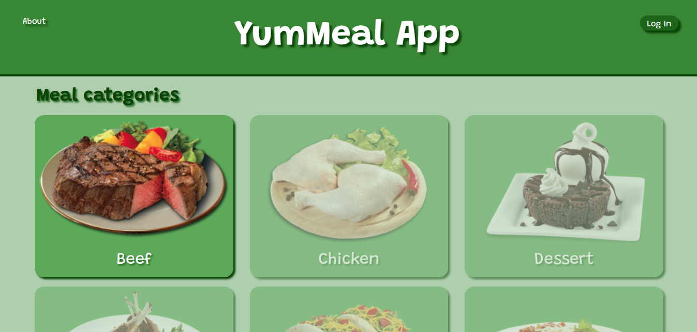

---

> Tablet Design

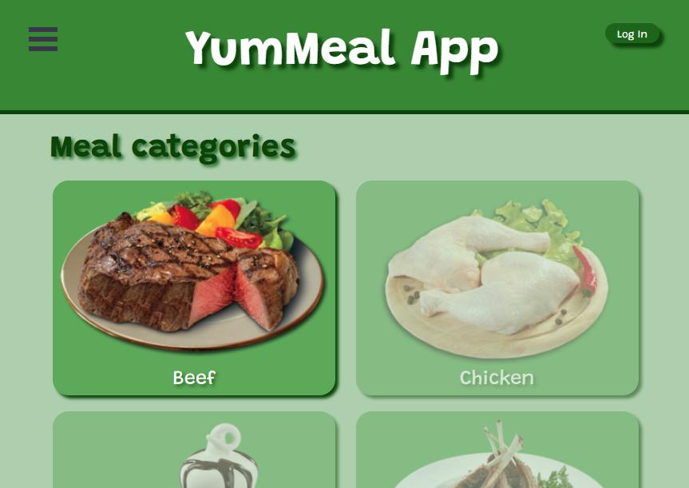

---

> Phone Design

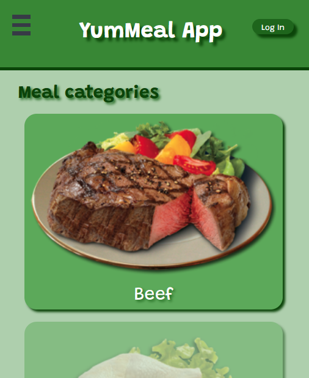

---

On the site you can search for your favorite meals and have detailed information about them.

You must be logged in order to have full access to the site. Loggin In allows you to explore all the meal categories, search meals by name or main ingredient, edit your personal profile, select your favourites meals to add them in your personal meal list, and add your own meal!!!.

## Technologies
This site was built using React JS. Además se utilizó JSX, HTML, CSS, Bootstrap y Axios.
All data is pulled from the [The MealDB](https://www.themealdb.com/) using Axios.

## Site Description

### Home Page

You must be logged In to gain full access to the site
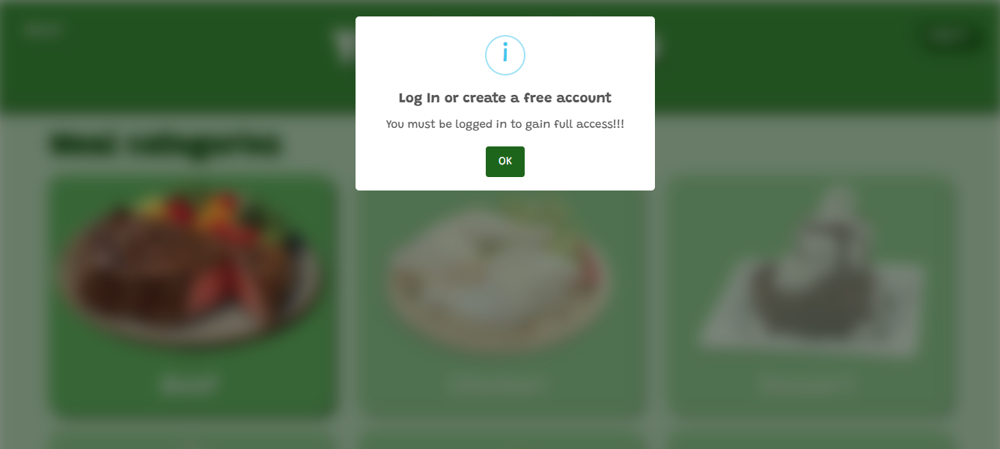

### Login and Sign Up
Click on the **Login Button**, enter your email and password to access to your site account.

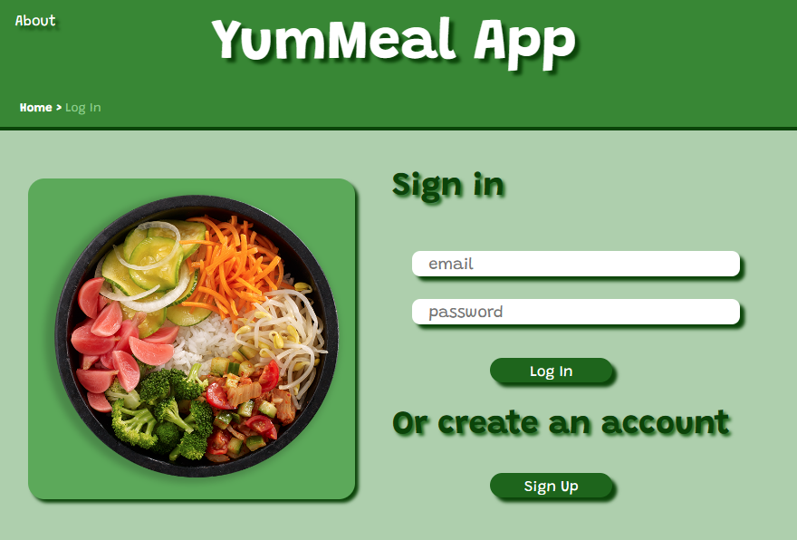

If you don't have an account you must **Sign Up**. Enter your email, and enter a password that complains with the rules showed.
After the registration process you will recive an email so you can validate your account.

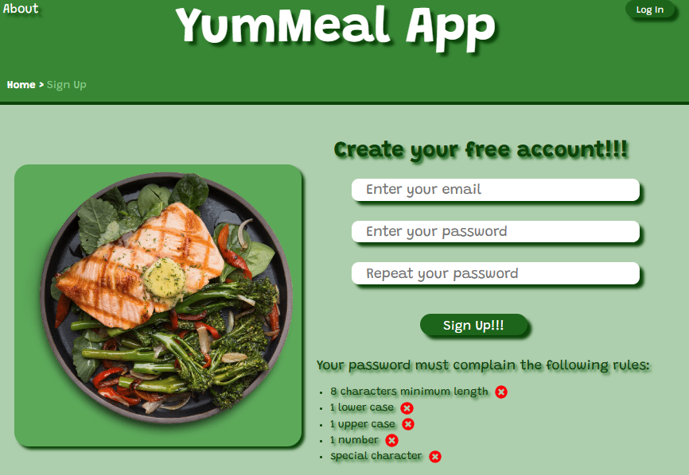

### Web Site Functions
Once you are logged In you can:
1.  Explore all the meal categories
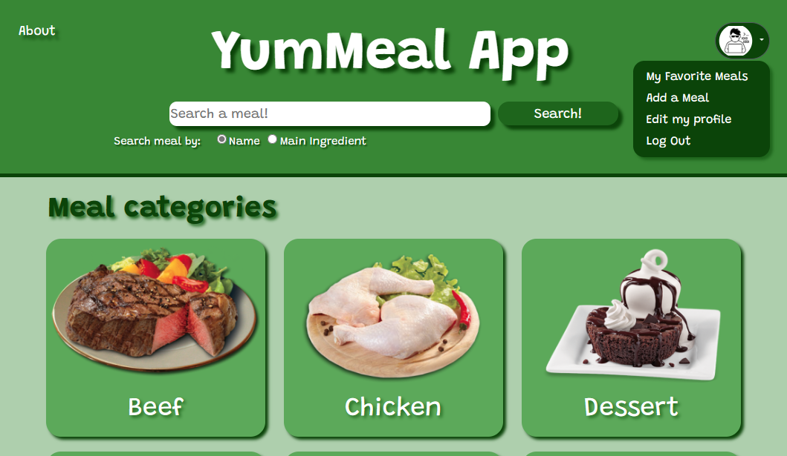
2.  Search meals by name or main ingredient
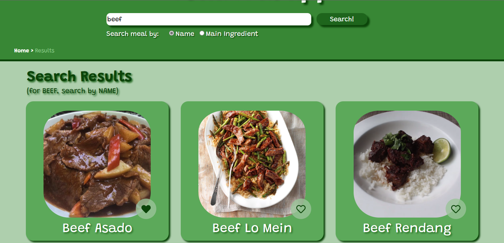
3.  Edit your personal profile
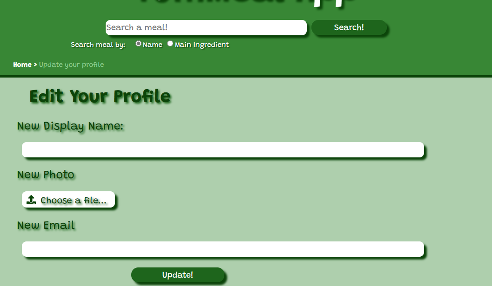
4.  Select your favourites meals to add them in your personal meal list
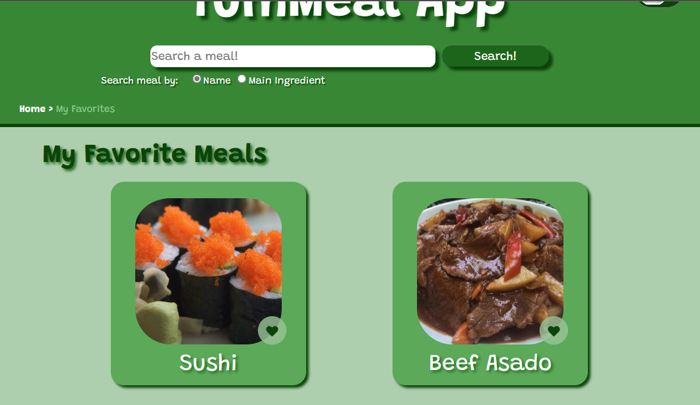
5.  Add your own meal.
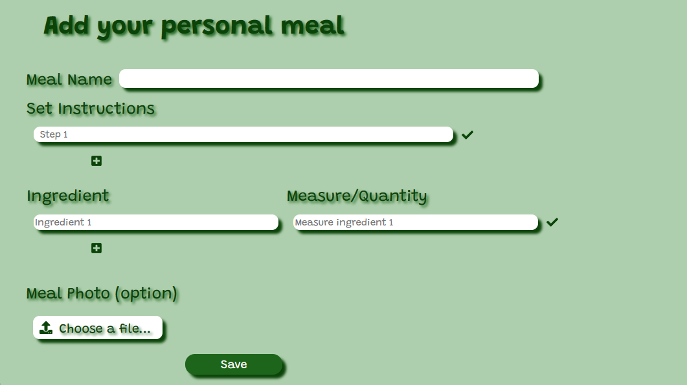

### Meal Details
You can see detailed information about the meals, regardless of whether you access by categories, through the search bar or the list of your favorite meals.
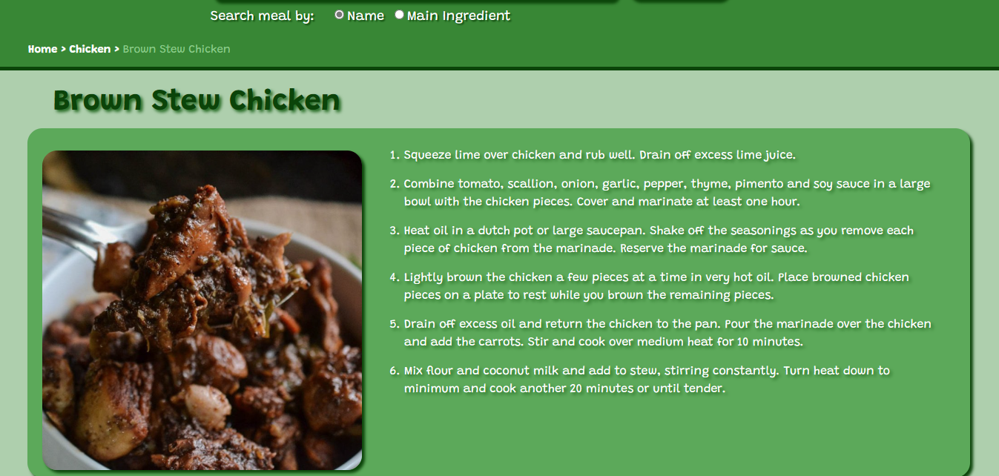
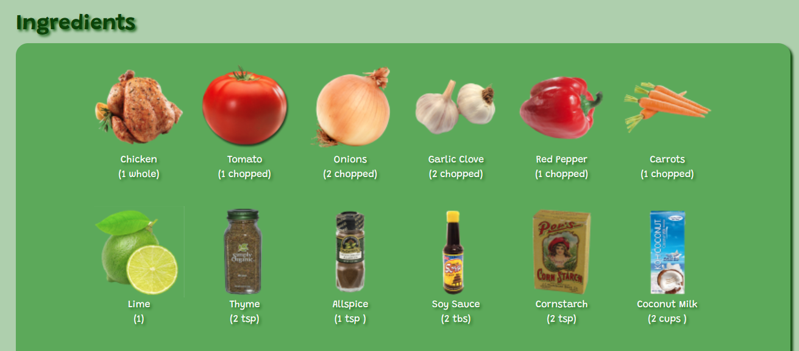

### About Page
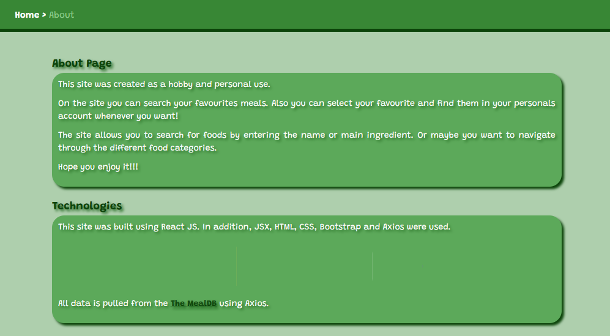

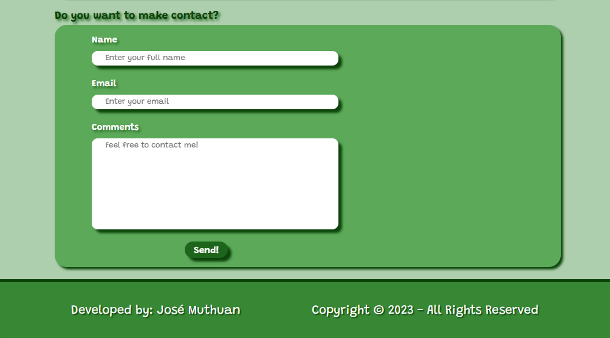

Here you will find information about the site, the technologies used to develop it, as well as information about the developer and a contact form.

*Hope you enjoy it!!!*